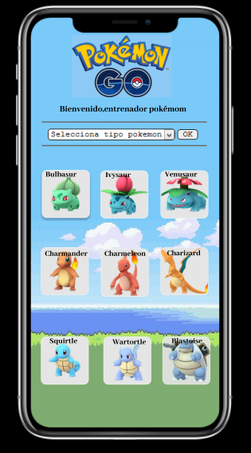

# **Guía de campeones Pokémon GO**

## Índice

* [Definición de producto](#Definición-de-producto)
* [Historias de usuario](#Historias-de-usuario)
* [Prototipo de baja fidelidad Sketch](#Prototipo-de-baja-fidelidad-Sketch)
* [Prototipo de alta fidelidad Figma](#Prototipo-de-alta-fidelidad-Figma)
* [Zeplin link](#Zeplin-link)
* [Testeos de Usabilidad](#Testeos-de-Usabilidad)

***

## Definición de producto
Hemos construido una página web que sirva como herramienta para mejorar el  desempeño del jugador habitual de Pokémon GO quien vendría a ser nuestro usuario objetivo.

Para diseñar esta web nos basamos en las entrevistas que realizamos a jugadores habituales de Pokémon GO   indagando sobre sus problemas más frecuentes y preguntándoles como creían ellos que mejoraría su experiencia y desempeño al jugar.

Sus respuestas indicaron que necesitaban ver la  información de pokemones presentada de  cierta manera y sobre todo algunas características que ellos consideran más importantes para  jugar mejor lo que se tradujo en nuestras historias de usuario.

Nuestro producto ayuda a mejorar la estrategia del usuario al manejar la información más requerida o relevante para  ellos además les ahorra tiempo al no tener que analizar toda la informacion y retenerla por ellos mismos.Nuestro usuario tendría la información mostrada en nuestra página a manera de guia al jugar Pokémon GO.

## Historias de usuario
* *Mostrar Data*: Según usuarios desean que se muestre por defecto en la web al ingresar solo información relevante como la imagen y el nombre para que sea más ordenada y simple de usar.

* *Filtrar Data*: Los usuarios indicaron que les gustaría un  filtro por tipo de pokemon porque conocer esta información les sería útil antes de empezar a jugar Pokemon GO.

* *Ordenar Data*: Usuarios desean que se les permita ordenar la data de manera alfabética ascendente(A-Z) y alfabética descendente(Z-A) ya que les ayudaría a encontrar más rápido el pokemón que les interesa.

* *Calcular Data*:Los jugadores de Pokémon GO indicaron que les ayudaría saber según  spawn_time el número de  pokemones que salgan probablemente en la mañana,tarde y noche.

## Prototipo de baja fidelidad Sketch

## Prototipo de alta fidelidad Figma
Se usaron los colores azul y verde ya que son los colores que predominan en Pokémon GO además los usuarios a los que entrevistamos también indicaron que les gustaría ver la web con los mismos colores de la aplicación Pokémon GO.

Asimismo el usuario pidió que la interfaz fuera ordenada y clara, con la pantalla por defecto cuando ingresaras con pocos datos principalmente que se viera la imagen de cada pokémon.

#### Interfaz

#### Interfaz en iphone

## Zeplin link

*web link*  
<https://zpl.io/Vkwe4pZ>  

*app URI*  
<zpl://screen?pid=5c2eded3bae2c22086c9fabe&sid=5c2edf791180cb21544c720c>

*Project Link*  
<https://zpl.io/VYGo6Nd>

## Testeos de Usabilidad  

* Para la historia de usuario 1 ,mostrar data,en la pantalla  que sale por defecto al ingresar a la web(en el prototipo de baja fidelidad) habíamos colocado imagen de cada pokemon con nombre de cada pokemon,probabilidad de verlo(avg_spawn) y tipo de pokemon pero usuario nos indico que sería más claro si al ingresar solo se veía la imagen del pokemon con su nombre, lo cual corregimos.

* En historia de usuario 2,filtrar data,usuario indico que el selector para escoger el tipo de pokemon debería estar a la izquierda del botón para filtrar y no a la derecha ya que era más intuitivo asi que se cambió.

* Asimismo en la historia de usuario 2,filtrar data, indicaron que en el campo de selección se debía agregar la información que indique incluir tipo de pokémon ya que el botón del costado que tenía por nombre filtrar no daba muchas pistas sobre la función que esta realizaba, por lo que se agrego la informacion al selector de pokémon y se puso en el botón correspondiente solo la palabra OK.
